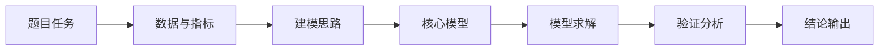

# Technical Roadmap And Model Flowcharts

Use this reference for 技术路线图, 技术路线, 流程图, 流程框图, or 模型流程图.

## Priority

For contest-final or paper-final diagrams:

1. Generate an editable source first: Mermaid (`.mmd`), Graphviz DOT (`.dot`), or SVG.
2. Export to SVG/PDF/PNG.
3. Use GPT Image only when the user explicitly wants a designed bitmap image.
4. Always keep the editable source file beside the exported image.

## Technical Roadmap Structure

Default logic:

`题目任务 -> 数据与指标 -> 建模思路 -> 核心模型 -> 模型求解 -> 验证分析 -> 结论输出`

Rules:

- Base the diagram on the provided problem, paper, or selected route.
- Do not add methods, data, metrics, or validation steps that are not in the solution.
- Keep labels short and high-level; put details in the caption or paper paragraph.
- Prefer 8-12 nodes for one subquestion and grouped lanes for multi-question papers.
- Avoid code-level steps unless they are central to the modeling logic.

## Model Flowchart Structure

Default logic:

`输入数据 -> 数据预处理 -> 变量构造 -> 模型假设 -> 模型方程/目标函数 -> 参数估计/算法求解 -> 结果输出 -> 验证与敏感性分析 -> 结论解释`

Task-specific additions:

- Optimization: objective, constraints, solver, feasibility check, baseline comparison, sensitivity.
- Prediction: train/validation split or rolling validation, baseline, error metrics, residual check.
- Evaluation: indicator direction, normalization, weighting, score/ranking, ranking stability.
- Simulation: state variables, transition rules, parameter estimation, repeated runs, boundary cases.

## Style

- Use a light background, high-contrast text, restrained colors, rectangular nodes, clear arrows, and no decorative icons.
- Size node text for the final paper canvas; labels should remain near body-text size after insertion.
- If labels overlap, remove nodes or shorten labels before shrinking text.
- Output a Chinese caption and one paper explanation paragraph with every diagram.

## Mermaid Starter

